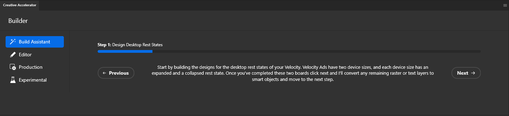
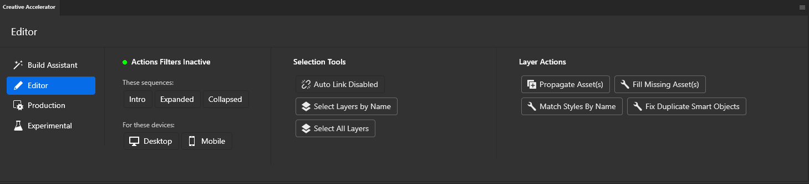
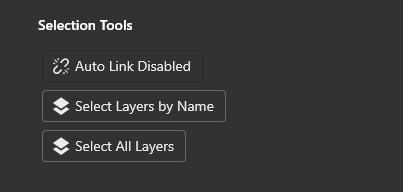
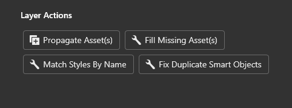
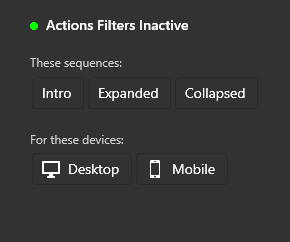
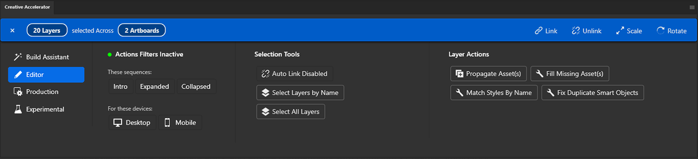

# Creative Accelerator

**A Photoshop UXP plugin to streamline and accelerate the creation of GumGum's proprietary Velocity ad format.**

This plugin is designed for designers working within Adobe Photoshop to build Velocity ad units. It simplifies the traditionally complex process of managing numerous artboards for different animation keyframes and states, making it easier to create, propagate edits, and ensure compatibility with GumGum's Creative Studio tool.

## Table of Contents

*   [Overview](#overview)
*   [Core Capabilities](#core-capabilities)
*   [Tech Stack & Architecture](#tech-stack--architecture)
*   [Core Technologies & Resources](#core-technologies--resources)
*   [Prerequisites](#prerequisites)
*   [Installation (for End Users)](#installation-for-end-users)
*   [Development Setup](#development-setup)
*   [Building the Plugin](#building-the-plugin)
*   [How to Use (User Guide)](#how-to-use-user-guide)
    *   [Getting Started](#getting-started)
    *   [Plugin Sections](#plugin-sections)
        *   [Build Assistant](#build-assistant)
        *   [Editor](#editor)
        *   [Production](#production)
        *   [Experimental](#experimental)
*   [Project Structure](#project-structure)
*   [Feedback and Contributions](#feedback-and-contributions)
*   [License](#license)

## Overview

The Creative Accelerator addresses the challenges designers face when building GumGum's Velocity ad format in Photoshop. This format often requires managing a large number of artboards to represent various keyframes and interactive states of an ad. This plugin provides tools and workflows to:

*   **Accelerate Design:** Significantly reduce the time spent on repetitive tasks.
*   **Simplify Complexity:** Make it easier to manage and edit content across multiple artboards.
*   **Ensure Consistency:** Help maintain uniformity in design elements that are shared or propagated.
*   **Guarantee Compatibility:** Produce artboard structures that are ready for ingestion by GumGum's Creative Studio, which assembles them into the final animated and interactive ad unit.

## Core Capabilities

*   **Advanced Artboard Management:** Tools for efficiently creating, duplicating, and organizing artboards representing animation frames and states.
*   **Smart Layer Linking (`useAutoLink`):** An intelligent system to automatically link or unlink layers across artboards based on selection and defined group structures, respecting active filters.
*   **Smart Object Handling:** Features to manage and fix duplicated or linked Smart Objects, ensuring instances are unique where needed and changes can be propagated correctly (e.g., `fixDuplicateSmartObjects`).
*   **Vector Mask Preservation:** Robust handling of vector mask data (`pathContents`), ensuring accurate capture and restoration of vector shapes during layer operations. (Leverages `getVectorInfo` and `restoreLayerState`).
*   **Efficient Dialog System:** Utilizes native UXP dialog elements for user interactions (e.g., input prompts, confirmations), ensuring compatibility and a smooth user experience within Photoshop.
*   **Cross-Artboard Editing & Propagation:** Tools to select matching layers across multiple artboards, link them, perform transformations, adjust layouts, and ensure assets persist across all required artboards, with options to filter the scope of these edits.

## Tech Stack & Architecture

*   **Platform:** Adobe UXP (Unified Extensibility Platform)
*   **UI Framework:** React v18.2.0
*   **UI Components:** Adobe Spectrum Web Components (SWC) via `@swc-react` and `@swc-uxp-wrappers`
*   **Animation (if applicable):** GSAP (`@gsap/react`, `gsap`)
*   **Build Tool:** Webpack 5
*   **Package Manager:** Yarn (v4.9.1)
*   **Language:** JavaScript (ES6 Modules)

**Architectural Highlights:**

*   **Component-Based UI:** Leverages React for a modular and maintainable user interface.
*   **Custom Hooks:** Encapsulates complex business logic and state management (e.g., `useAutoLink`).
*   **UXP Native Integration:** Employs UXP best practices, such as using native dialogs.
*   **Photoshop Scripting:** Interacts with Photoshop's core functionalities via `executeAsModal` and other UXP APIs.

## Core Technologies & Resources

This plugin leverages several key Adobe technologies and APIs to provide its functionality within Photoshop:

*   **UXP (Unified Extensibility Platform):** The foundational framework for building modern plugins for Adobe Creative Cloud applications like Photoshop. UXP enables plugins to be built with web technologies (HTML, CSS, JavaScript) and provides APIs for interacting with the host application and the user interface.
*   **Photoshop UXP APIs:** These are specific extensions to the UXP core that allow the plugin to interact directly with Photoshop. This includes manipulating documents, layers, artboards, running commands, and responding to Photoshop events.
*   **Spectrum Web Components (SWC):** The user interface of this plugin is built using Spectrum Web Components, Adobe's open-source implementation of its design system. SWC provides a consistent Adobe look and feel.
*   **SWC-UXP-Wrappers:** To seamlessly integrate SWC into the UXP environment, especially when using frameworks like React (as this plugin does), `swc-uxp-wrappers` are used. These wrappers adapt the standard web components for optimal use within UXP panels.
*   **BatchPlay:** For complex or highly specific Photoshop operations that may not have a direct high-level API, BatchPlay is utilized. It allows the execution of Photoshop's internal action descriptors, offering deep control over the application's features.
*   **Alchemist & Action Recording:** To identify the correct parameters for BatchPlay, developers often use tools like Alchemist or Photoshop's built-in Action Recorder. These help translate UI operations into the code needed for BatchPlay.

Below are some valuable resources for understanding these technologies and for UXP development in general:

*   [**UXP Developer Tool:**](https://developer.adobe.com/photoshop/uxp/2022/guides/) Essential for loading, debugging, and packaging UXP plugins.
*   [**UXP API Documentation:**](https://developer.adobe.com/photoshop/uxp/2022/uxp-api/) Core UXP APIs for UI, file system, network, etc.
*   [**Photoshop API Reference:**](https://developer.adobe.com/photoshop/uxp/2022/ps_reference/) Photoshop-specific UXP APIs for document and layer manipulation.
*   [**Spectrum Web Components (SWC):**](https://opensource.adobe.com/spectrum-web-components/) Adobe's design system implemented as Web Components.
*   [**SWC-UXP-Wrappers:**](https://github.com/adobe/swc-uxp-wrappers) Library for using SWC within UXP, especially with React.
*   [**BatchPlay:**](https://developer.adobe.com/photoshop/uxp/2022/ps_reference/media/batchplay/) API for executing low-level Photoshop commands.
*   [**Alchemist Plugin/Workflow:**](https://github.com/jardicc/alchemist) Tool to discover Action Descriptors for BatchPlay.
*   [**Action Recording in Photoshop:**](https://developer.adobe.com/photoshop/uxp/2022/ps_reference/media/action-recording/) Built-in feature to record steps, useful for BatchPlay.
*   [**Creative Cloud Developer Forums:**](https://forums.creativeclouddeveloper.com/) Community forum for UXP and Creative Cloud development.

## Prerequisites

*   **Adobe Photoshop:** Version 24.4.0 or newer (as per `manifest.json`).
*   **Adobe Creative Cloud Desktop Application:** For plugin installation and management.
*   **(For Developers) Node.js:** Version 16.0.0 or newer (Recommended: Latest LTS).
*   **(For Developers) Yarn:** Version 1.x (Classic) or newer (project uses Yarn 4.x). [Yarn Installation](https://yarnpkg.com/getting-started/install)
*   **(For Developers) UXP Developer Tool (UDT):** Required for loading and debugging.

## Installation (for End Users)

1.  **Obtain the Plugin Package:** You will receive a `.ccx` file for the Creative Accelerator plugin.
2.  **Install the Plugin:**
    *   Double-click the `.ccx` file.
    *   The Creative Cloud Desktop application should open and prompt you to install the plugin. Follow the on-screen instructions.
    *   Alternatively, you can install it through the Creative Cloud Desktop app's "Stock & Marketplace" > "Plugins" > "Manage plugins" section by finding the downloaded `.ccx` file.
3.  **Enable in Photoshop:**
    *   Once installed, open Adobe Photoshop.
    *   The "Creative Accelerator" panel should be available under Photoshop's "Plugins" menu. Click it to open the panel.

## Development Setup

1.  **Clone the repository:**
    ```bash
    git clone <repository-url>
    cd studio-accelerator
    ```
2.  **Install dependencies:**
    ```bash
    yarn install
    ```
3.  **Build and Watch:**
    ```bash
    yarn watch
    ```
    This compiles the plugin into `dist` and re-compiles on file changes.
4.  **Load into Photoshop via UDT:**
    *   Open Photoshop and the UXP Developer Tool.
    *   In UDT, click "Add Plugin..." and select `manifest.json` from the project root.
    *   Click `•••` (Actions) next to "Creative Accelerator" and select "Load".
    *   Recommended: Also select "Watch" from the `•••` menu for automatic reloading.

## Building the Plugin

*   **Development Build (with watch mode):**
    ```bash
    yarn watch
    ```
*   **Production Build (for creating `.ccx` or distribution):**
    ```bash
    yarn build
    ```
    This creates an optimized build in the `dist` folder.
*   **Start (One-off build):**
    ```bash
    yarn start
    ```

## How to Use (User Guide)

### Getting Started

*   **Installation:** Follow the [Installation (for End Users)](#installation-for-end-users) guide.
*   **Docking the Plugin:** Once the plugin panel is open, it's **strongly recommended** to dock it to a convenient location in your Photoshop workspace, such as the bottom of the viewport, for easy access.
*   **Using Templates:** While the plugin can be used on any Photoshop document, most features are optimized for and will provide the most value when working with GumGum's provided PSD templates for Velocity or Hangtime ad formats. Starting with these templates is highly recommended.

### Plugin Sections

The Creative Accelerator plugin is organized into several key sections, each catering to different stages and needs of the ad creation workflow:

#### Build Assistant

*   **Purpose:** Acts as a wizard to guide new designers (or those new to the Velocity/Hangtime formats) through the creative build process.
*   **Functionality:** Helps ensure all relevant assets are correctly linked, formatted, and structured in a way that GumGum's Creative Studio tool can interpret.
*   **Recommendation:** If you're new to this creative process, it's highly recommended to start with the Build Assistant.



#### Editor

*   **Purpose:** Provides granular, context-specific tools for experienced designers or those working on revisions and detailed edits.



*   **Key Features:**
    *   **Multi-Artboard Selection:** Shortcuts for selecting matching layers across multiple artboards.
        
    *   **Layer Linking:** Tools to link layers together for synchronized editing.
    *   **Transformations & Layout:** Efficiently perform transformations and layout adjustments across linked or selected layers/artboards.
    *   **Layer-Specific Actions:** Quick access to common operations for selected layers.
        
    *   **Asset Persistence:** Ensure assets (like logos, CTAs) persist correctly across all required artboards.
    *   **Scoped Edits:** Limit the scope of your edits to specific subsets of artboards using filter toggles.
        
*   **Goal:** Combined, these tools make otherwise very manual and time-consuming operations substantially faster and easier.

The Editor panel becomes particularly powerful when working with multiple selections, enabling rapid changes across your design:



**Contextual Action Bar:**

When you select layers or artboards, a contextual action bar appears at the bottom of the plugin, providing quick access to relevant bulk operations:

*   **Basic Actions (Single Artboard):** When layers within the same artboard/group are selected.
    
*   **Artboard-Specific Actions:** When artboards are selected.
    
*   **Actions for Multiple Selections (Cross-Artboard):** When multiple items are selected across different artboards.
    
*   **Invalid/Mixed Selections:** The action bar also provides feedback if an action is not applicable to the current selection.
    

#### Production

*   **Purpose:** (Work in Progress) This section will ultimately provide tools for finalizing your project for handoff to Creative Studio.
*   **Future Functionality:** Expect tools for converting assets, normalizing properties, fixing common issues, and generally prepping all artboards and assets to ensure a smooth transition into Studio.
*   **Current Status:** More to come on this section in the future.

#### Experimental

*   **Purpose:** A space for exploring new capabilities and workflows that could further simplify and evolve the creation of Velocity and Hangtime ad formats.
*   **Current Status:** Features in this tab are constrained tests and proofs of concept. They are **not recommended** for use in live production workflows at this time but may mature into standard features in the future.

## Project Structure

```
studio-accelerator/
├── .git/                # Git version control
├── .yarn/               # Yarn 2+ PnP files
├── assets/              # Static assets (e.g., images for README)
├── dist/                # Bundled plugin files (output of webpack)
├── icons/               # Plugin icons used in Photoshop UI
├── src/                 # Source code
│   ├── actions/         # Photoshop scripting logic, UXP commands (e.g., fixDuplicateSmartObjects.js)
│   ├── components/      # React components
│   ├── constants/       # Application-wide constants (e.g., namingConventions.js)
│   ├── hooks/           # Custom React hooks (e.g., useAutoLink)
│   ├── utilities/       # Helper functions and utilities (e.g., dialogs.js)
│   ├── index.html       # HTML entry point for the UXP panel
│   ├── index.js         # Main JavaScript entry point for React application
│   └── App.js           # Root React component
├── .babelrc             # Babel configuration
├── .gitignore           # Files and folders to ignore for Git
├── manifest.json        # UXP plugin manifest
├── package.json         # Project metadata, dependencies, and scripts
├── webpack.config.js    # Webpack build configuration
└── yarn.lock            # Yarn lockfile
```

## Feedback and Contributions

This tool is very much a work in progress. As you start to utilize this plugin in your everyday work, please expect to encounter bugs and occasional unpredictable behaviors.

We welcome any input, feedback, and bug reports you can provide.
*(Suggestion: You might want to add a link here to an issue tracker like GitHub Issues, or an email address for feedback if applicable).*

## License

This project is licensed under the ISC License.
